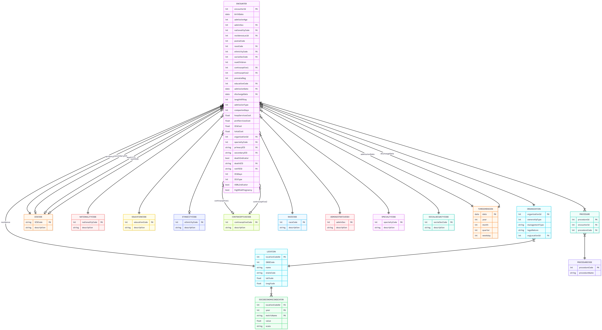

# datasus-conversational-agent

First NL→SQL conversational agent for DATASUS data, achieving 93.3% execution accuracy over 18.7 million hospital admission records.

---

## About the Project

This repository contains the artifacts of the paper "A Conversational Agent for Natural Language Access to Public Health Data", submitted to CBMS 2026.
The agent translates natural-language Portuguese queries into executable SQL over the Hospital Information System in Reduced Data format (SIH-RD) from DATASUS, covering 18,671,329 hospital admissions from the states of Rio Grande do Sul and Maranhão between 2008 and 2023.
The pipeline is built on LangGraph with 9 modular stages, 15 SUS domain-specific SQL generation rules, and requires no model fine-tuning.

---

## Database

### Data Source
Data was collected from SIH-RD via the PySUS library, in the Reduced Data format (RD) — the contracted version from DATASUS that enables processing on commodity local hardware. The data consists of public microdata containing no personally identifiable information (PII), ensuring compliance with the Brazilian General Data Protection Law (LGPD).

### Schema

The database is modeled as a Snowflake Schema, optimized for OLAP analytical workloads, comprising:

| Prefix | Type       | DATASUS Name    | FHIR Name               |
|:-------|:-----------|:----------------|:------------------------|
| `TF_`  | Fact       | `internacoes`   | `Encounter`             |
| `RL_`  | Bridge     | `atendimentos`  | `Procedure`             |
| `TD_`  | Dimension  | `hospital`      | `Organization`          |
| `TD_`  | Dimension  | `municipios`    | `Location`              |
| `TD_`  | Dimension  | `cid`           | `ICDCode`               |
| `TD_`  | Dimension  | `procedimentos` | `ProcedureCode`         |
| `TD_`  | Dimension  | `especialidade` | `SpecialtyCode`         |
| `TD_`  | Dimension  | `sexo`          | `AdministrativeSex`     |
| `TD_`  | Dimension  | `raca_cor`      | `RaceCode`              |
| `TD_`  | Dimension  | `etnia`         | `EthnicityCode`         |
| `TD_`  | Dimension  | `nacionalidade` | `NationalityCode`       |
| `TD_`  | Dimension  | `instrucao`     | `EducationCode`         |
| `TD_`  | Dimension  | `vincprev`      | `SocialSecurityCode`    |
| `TD_`  | Dimension  | `contraceptivos`| `ContraceptiveCode`     |
| `TD_`  | Dimension  | `tempo`         | `TimeDimension`         |
| `TD_`  | Analytical | `socioeconomico`| `SocioeconomicIndicator`|

---

## Benchmark

The benchmark comprises 120 Portuguese-language queries with gold-standard SQL, stratified into three difficulty tiers:

| Tier   | N  | Structural Criteria                                                                |
|:-------|:---|:-----------------------------------------------------------------------------------|
| Easy   | 40 | Single table; basic filter or simple aggregation; no joins                         |
| Medium | 40 | Two-table FK join, or single-table temporal/grouped aggregation                    |
| Hard   | 40 | ≥2 joins, multi-step reasoning, or computed metrics across dimensional hierarchies |

Queries span four analytical dimensions: **aggregation**, **temporal filtering**, **geographic analysis**, and **multi-table joins**.

The `ground_truth.json` file contains for each query: `id`, `difficulty`, `question`, `query` (gold-standard SQL), `tables`, and `notes` with relevant modeling decisions.

---

## Agent Pipeline

The agent is implemented in **LangGraph** across 9 sequential stages:

1. **Query Classification** — routing: DATABASE, conversational, schema, or ambiguous
2. **Table Selection** — identification of relevant tables via regex fast-path or LLM
3. **Schema Retrieval** — fetches columns, types, FKs, and value ranges exclusively for selected tables
4. **CoT Planning** — chain-of-thought planning for complex queries (per-group top-N, global vs. local averages, temporal comparisons)
5. **SQL Generation** — synthesis using RULES A–O, SUS-specific value mappings, and per-table few-shot examples
6. **SQL Validation** — static syntax and schema alignment check
7. **SQL Execution** — query execution against DuckDB
8. **Self-Repair** — error recovery: schema-level (rerouting to table selection) or syntax-level (targeted regeneration), up to 2 retries
9. **Response Generation** — natural-language formatting; guara

### Results

| System              | Easy (n=40) | Medium (n=40) | Hard (n=40)      | Overall (n=120) |
|:--------------------|:------------|:--------------|:-----------------|:----------------|
| Prompt Baseline     | 97.5%       | 100.0%        | 72.5%            | 90.0%           |
| LangGraph Agent     | 100.0%      | 97.5%         | 82.5%            | **93.3%**       |
| Δ (Agent − Baseline)| +2.5 pp     | −2.5 pp       | **+10.0 pp**     | +3.3 pp         |

McNemar's exact test: b=6, c=2, p=0.289. Wilson 95% CI: agent [87.4%, 96.6%], baseline [83.3%, 94.2%].

## Code Availability

> **The agent and data pipeline source code will be made publicly available in this repository upon paper acceptance.**

Artifacts currently available:
- `ground_truth.json` — full benchmark with 120 gold-standard queries
- Data dictionary and database schema 
